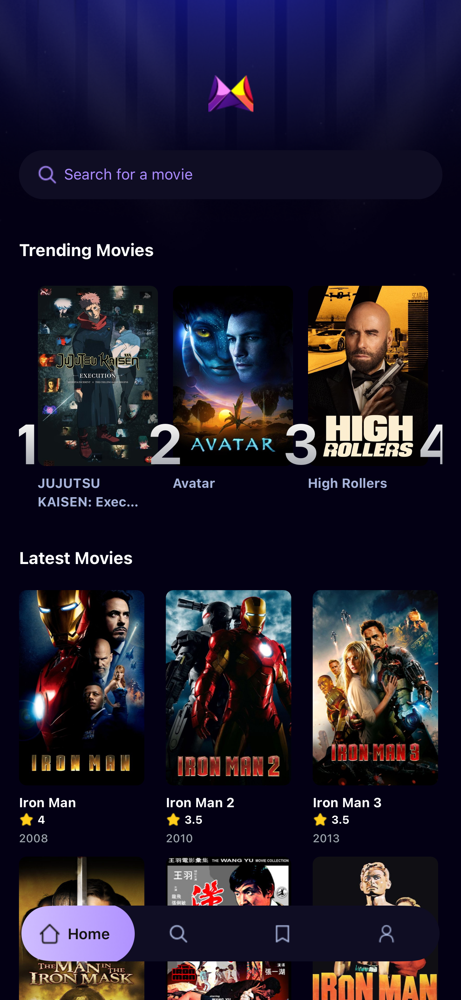
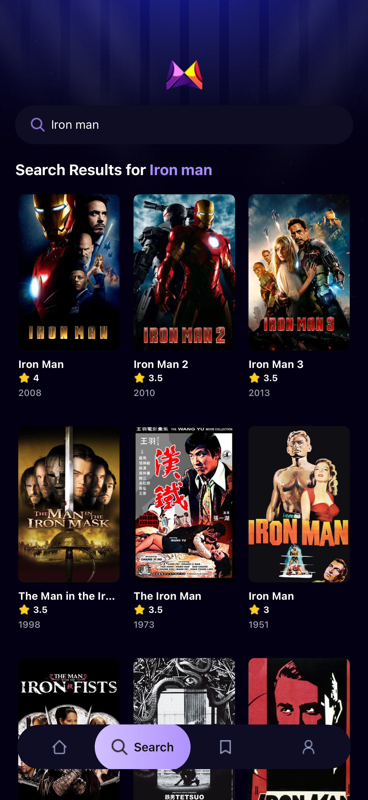
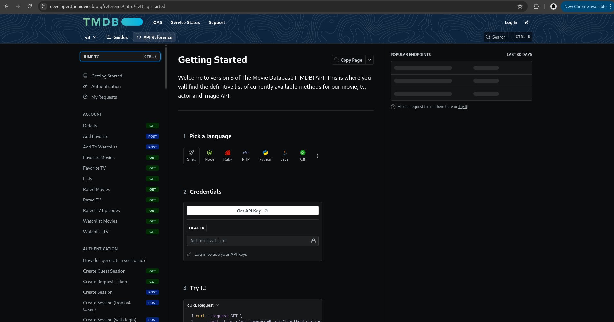
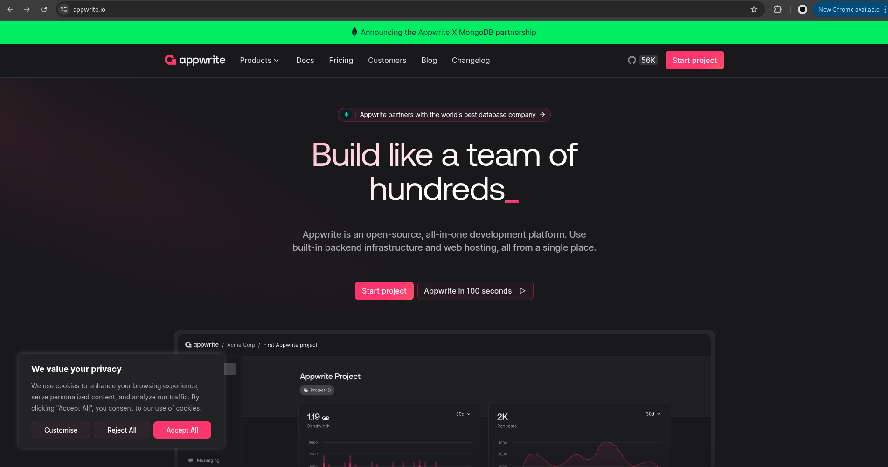

# MovieApp

A React Native movie discovery app built with Expo, Expo Router, NativeWind, TMDB, and Appwrite.

## Features

- Browse popular movies
- Search movies from TMDB
- View movie details
- Track trending searches with Appwrite
- Mobile-first UI built with Expo Router and NativeWind

## Tech stack

- Expo
- React Native
- TypeScript
- Expo Router
- NativeWind
- TMDB API
- Appwrite

## Screenshots

### Home



### Search



### TMDB setup



### Appwrite setup



## Prerequisites

Before you start, make sure you have:

- Node.js 18 or newer
- npm
- Expo Go on your phone, or an Android emulator / iOS simulator
- A TMDB account and API access
- An Appwrite project if you want trending-search tracking to work

## Project setup

1. Clone the repo and move into the project folder.

```bash
git clone <your-repo-url>
cd MovieApp-ReactNative-TMDB-API--TailwindCSS
```

2. Install dependencies.

```bash
npm install
```

3. Create your local environment file.

```bash
cp .env.example .env
```

4. Fill in the values inside `.env`.

This app uses both a TMDB bearer token and a TMDB API key because the current codebase reads both.

## Environment variables

Use these exact variable names in `.env`:

```env
EXPO_PUBLIC_MOVIE_API_KEY=your_tmdb_bearer_token
EXPO_PUBLIC_TMDB_API_KEY=your_tmdb_v3_api_key
EXPO_PUBLIC_APPWRITE_PROJECT_ID=your_appwrite_project_id
EXPO_PUBLIC_DATABASE_ID=your_appwrite_database_id
EXPO_PUBLIC_TABLE_ID=your_appwrite_collection_or_table_id
EXPO_PUBLIC_APPWRITE_PROJECT_NAME=your_appwrite_project_name
EXPO_PUBLIC_APPWRITE_ENDPOINT=https://cloud.appwrite.io/v1
```

## How to get the TMDB keys

1. Create an account at TMDB.
2. Open your TMDB account settings.
3. Create API credentials.
4. Copy your API Read Access Token into `EXPO_PUBLIC_MOVIE_API_KEY`.
5. Copy your API Key (v3 auth) into `EXPO_PUBLIC_TMDB_API_KEY`.

The screenshot above in `assets/images/readme/tmdb_api.png` shows the general area you need.

## How to set up Appwrite

Appwrite is used here for trending search metrics.

Create:

- 1 Appwrite project
- 1 database
- 1 collection or table for search metrics

Then add the matching IDs to `.env`.

The search metrics collection should support these fields because the app writes them in `services/appwrite.ts`:

- `searchTerm` as string
- `movie_id` as number
- `count` as number
- `poster_url` as string
- `title` as string

The Appwrite setup screenshot is included above in `assets/images/readme/appwrite.png`.

## Run the app

Start the Expo dev server:

```bash
npm run start
```

You can also use:

```bash
npm run android
npm run ios
npm run web
```

After Expo starts, you can:

- scan the QR code with Expo Go
- press `a` for Android
- press `i` for iOS on macOS
- press `w` for web

## Useful scripts

Install dependencies:

```bash
npm install
```

Run lint:

```bash
npm run lint
```

Run a TypeScript check:

```bash
npx tsc --noEmit
```

## Project structure

```text
app/                  Expo Router screens
components/           Reusable UI components
constants/            Images and icons
services/             TMDB and Appwrite integrations
interfaces/           Shared TypeScript interfaces
assets/               Images and static assets
```

## Troubleshooting

- If the app starts but no movies load, check your TMDB keys in `.env`.
- If trending movies do not appear, verify your Appwrite project, database, and collection IDs.
- If Expo seems stuck on old code, run `npx expo start -c`.
- If lint fails, run `npm install` again and then `npm run lint`.
- If TypeScript fails, run `npx tsc --noEmit` to see the exact file and line.

## Notes

- `.env` is for your local machine and should not be committed.
- `.env.example` is the safe template new developers should copy.
- The current Appwrite integration is used for search metrics, not for user authentication.
